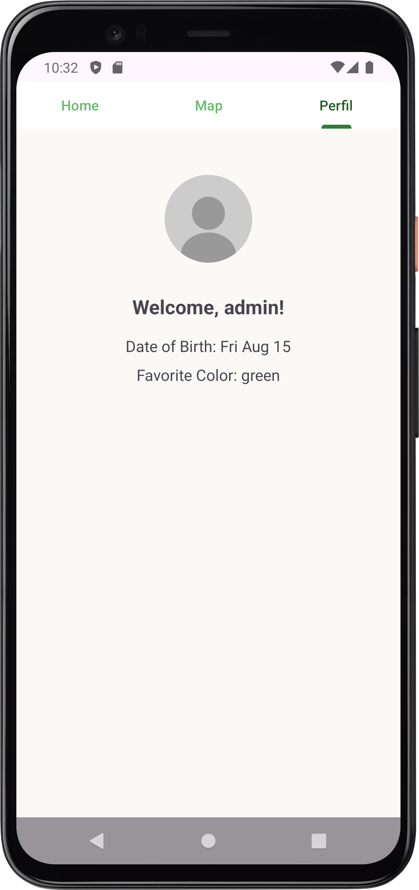

# Smart Agriculture Monitoring System

## About the Project

The **Smart Agriculture Monitoring System** is an Android application developed to monitor environmental sensor data in real-time. With an intuitive and functional interface, the system allows users to visualize information such as temperature, humidity, pressure, and other data collected by distributed sensors.

---

## Features

- **User Authentication**: Secure login with email and password.
- **Pin Visualization on Map**: Each pin on the map represents a location with sensors.
- **Sensor Details**: List of sensors available at each pin with detailed information.
- **Data Simulation**: Sensor values are dynamically updated for demonstration purposes.
- **Profile Management**: Users can view their profiles.

---

## Screenshots

### Login Screen
Users enter their email and password for authentication.


---

### Main Screen (Home)
Displays a list of available pins and allows exploration of the sensors for each pin.


---


### Map Tab
The **Map Tab** provides a dynamic and interactive map interface to visualize sensor locations.

#### Features:
1. **Pin Display**:
   - Displays pins representing monitored locations fetched from **Firestore**.
   - Each pin corresponds to a unique location with a name (e.g., "House1", "House2").

2. **Sensor Details**:
   - Clicking on a pin opens a bottom sheet dialog displaying:
     - Sensor type (e.g., temperature, humidity).
     - Latest reading value and unit.

3. **Use of ViewModel**:
   - A **ViewModel** is employed to manage and fetch sensor data asynchronously. It ensures separation of concerns and retains data during configuration changes.
   
   
#### Screenshots:
- **Map Overview with Pins**  
  

- **Sensor Details Bottom Sheet**  
  
   
   
---

### Profile Screen
Users can view personal information, such as their date of birth and favorite color.



---

## Database Structure

The application uses **Firebase Firestore** for data storage.

### Collection `user_info`
Stores user information:
```json
{
  "user_info": {
    "uid": {
      "color": "green",
      "dob": "2003-08-15T00:00:00Z"
    }
  }
}
```

### Collection `pins`
Stores pins and sensor information:
```json
{
  "pins": {
    "pinID": {
      "latitude": 40.642704,
      "longitude": -8.651454,
      "pinName": "House2",
      "sensors": [
        {
          "description": "Xiaomi temperature sensor",
          "typeSensor": "temperature",
          "unit": "°C",
          "value": [22.5, 23.0, 24.1],
          "timestamp": [1672531200000, 1672534800000, 1672538400000]
        }
      ]
    }
  }
}
```

---

## Technologies Used

- **Android SDK**
- **Firebase Firestore** for data storage.
- **Firebase Authentication** for user authentication.
- **OSMDroid** for map rendering.

---

## Project Structure

- **`MainActivity`**: Manages user login.
- **`HelloWorldActivity`**: Controls the tabs (Home, Map, Profile).
- **`HomeFragment`**: Lists pins and sensors.
- **`MapFragment`**: Displays the map with pins and details.
- **`ProfileFragment`**: Shows user profile information.
- **`MapViewModel`**: Manages database operations.

---

## Future Improvements

- Add support for notifications when a sensor reaches critical values.
- Implement integration with external APIs for weather forecasts.
- Enhance the interface with a more modern design.

---

## License

This project is distributed under the MIT license. See the `LICENSE` file for more details.

